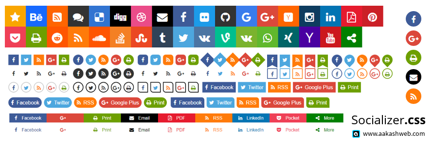

# Socializer.css

Socializer is a css library to create customizable social media sharing buttons and floating sharebars easily with handful of predefined classes and styles.

[](http://http://www.aakashweb.com/demos/jquery-conditioner)

[Socializer button generator](http://www.aakashweb.com/apps/social-buttons-generator/)

## Features

- **35 icon color schemes** including all famous social media sites
- 6 button shapes, 8 hover styles, 5 text styles, 3 layout types, 17 border, background and shadow styles in total = **12240 different customizations**. See below for the class names.
- Support for **vertical icons**
- Support for **floating sharebar**, both vertical and horizontal.
- Support for **more** menu
- Supports custom icon fonts or images.

## Usage

Socializer css libary requires the following resources to be included and the HTML for the social button can be created either with or without socializer.js

- The socializer css libary itself
- Fontawesome icon font or any other icon font or custom image icons
- Socializer.js to automatically generate HTML on the fly, similar to a social button widget is required.

There is a web app to [generate social buttons](http://www.aakashweb.com/apps/social-buttons-generator/) code for socializer CSS library.

### Includes

```HTML
<link rel="stylesheet" type="text/css" href="https://cdn.rawgit.com/vaakash/socializer/master/socializer.css">
<link rel="stylesheet" href="https://maxcdn.bootstrapcdn.com/font-awesome/4.6.1/css/font-awesome.min.css">
```

### With socializer.js

```HTML
<!-- Turns into social sharebar -->
<div class="socializer" data-features="32px,circle,icon-white,pad" data-sites="facebook,googleplus,print,email,rss"></div>

<script src="https://cdn.rawgit.com/vaakash/socializer/master/js/socializer.js"></script>
<script>
(function(){
    socializer( '.socializer' );
}());
</script>
```

### Without socializer.js

```HTML
<ul class="socializer sr-32px sr-icon-white"> <!-- Customization class names go here -->
    <li class="sr-twitter">
        <a href="#"><i class="fa fa-twitter"></i></a>
    </li>
    <li class="sr-facebook">
        <a href="#"><i class="fa fa-facebook"></i></a>
    </li>
    <li class="sr-googleplus">
        <a href="#"><i class="fa fa-google-plus"></i></a>
    </li>
</ul>
```

## Available CSS classes

Social bar is identified with the class `socializer`. All classes below should be prefixed with `sr-`

| Sizes | Shapes     | Hover effects | Layout types | Text styles | Border colors | Background colors | Icon colors | Border styles | Others    |
|-------|------------|---------------|--------------|-------------|---------------|-------------------|-------------|---------------|-----------|
| 32px  | circle     | opacity       | fluid        | text-in     | bdr-white     | bg-white          | icon-white  | bdr-sm        | pad       |
| 40px  | squircle   | rotate        | vertical     | text-out    | bdr-dark      | bg-dark           | icon-dark   | bdr-md        | multiline |
| 48px  | squircle-2 | zoom          |              | text-below  | bdr-grey      | bg-grey           | icon-grey   | bdr-lg        |           |
| 64px  | diamond    | shrink        |              | text-hover  |               | bg-none           | icon-none   | bdr-none      |           |
|       | drop       | float         |              |             |               |                   |             |               |           |
|       | ribbon     | sink          |              |             |               |                   |             |               |           |
|       |            | fade-white    |              |             |               |                   |             |               |           |
|       |            | fade-black    |              |             |               |                   |             |               |           |

## Floating Sharebar

Socializer.css has support for floating sharebars too. The main sharebar should be wrapped in a tag which holds the floating sharebar related classes.

```HTML
<div class="sr-sharebar sr-sb-hl sr-sb-top">
    <!-- Socializer sharebar HTML -->
</div>
```

### Available floating sharebar CSS classes

Sharebar is identified with the `sr-sharebar` class assigned to the parent of the social bar. All classes below should be prefixed with `sr-sb-`.

| Type | Position | Themes |
|------|----------|--------|
| hl   | top      | white  |
| vl   | bottom   | dark   |
|      | left     |        |
|      | right    |        |

### Documentation

[Click here](http://www.aakashweb.com/docs/socializer-css/) to see the docs of this plugin.

### WordPress plugin

WP Socializer is a wordpress plugin for social media buttons and it uses `socializer.css` for sharebar. [Check it out](http://www.aakashweb.com/wordpress-plugins/wp-socializer/)

### License

Copyright (c) 2016 [Aakash Chakravarthy](http://www.aakashweb.com/), released under the MIT License.